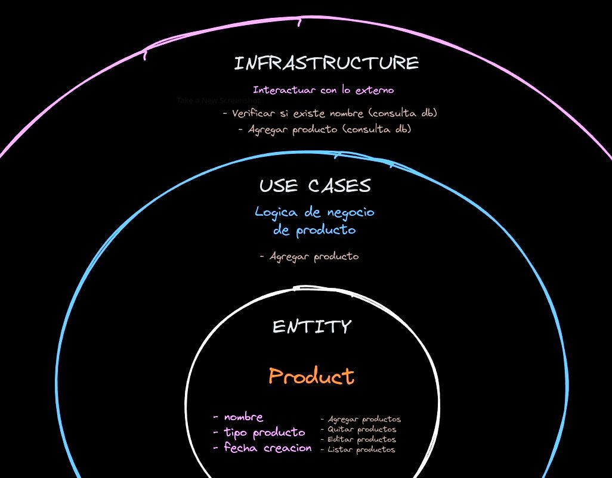

# CLEAN ARCHITECTURE IN NEXT JS

## Tools
  - Next js 14.2.7
  - Drizzle orm 0.32.1
  - Zod 3.23.8
  - Query string 9.1.0
  - Inversify 6.0.2
  - Reflect metadata 0.2.2
  - Server actions
  - Shadcn
  - Mysql

## Layers
- Domain: This layer contains the core entities of the application, as well as the definitions (interfaces) for the repository and use cases. It represents the business logic and rules.

- Infrastructure: This layer provides the implementation of the repository interfaces defined in the domain layer. It handles the actual interaction with external systems like databases, APIs, and other services.

- Use Case: This layer contains the implementation of the use case interfaces defined in the domain layer. It orchestrates the business logic and coordinates between the domain and infrastructure layers.

- Interface: This layer is implicit and represents the external entry points, such as controllers, APIs, or user interfaces, that interact with the underlying layers.



## Install
  - Install dependencies
  ```
    bun install
  ```
  
  - Create database with docker, run this:
  ```
  docker run --name mysql-db \
        -e MYSQL_ROOT_PASSWORD=secret \drizzle-kit generate
        -e MYSQL_DATABASE=logistics_db \
        -p 3309:3306 \
        -d mysql:8.0

  ```
  - Migrate tables inside db with drizzle
  ```
  bun run drizzle-kit generate
  ```

  - Run app
  ```
  bun run dev
  ```
